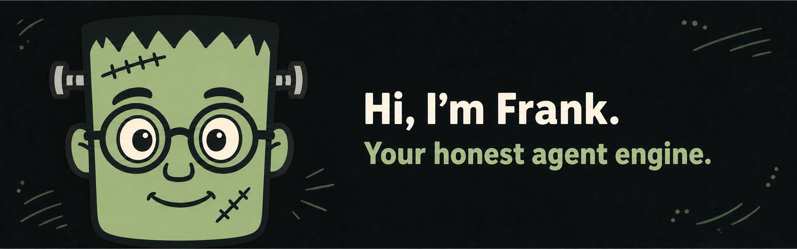

<p align="center">
  
</p>

# Frank 🧟‍♂️⚡

> *"IT'S ALIVE!... and it's super friendly, nerdy, and ready to save your tokens!"*

Meet **Frank** — your friendly, nerdily precise Frankenstein monster of an AI persona engine and prompt compressor. Stitched together from high-performance Rust crates, Frank stands guard between you and your AI coding assistants (like Claude Code, Codex, and Cline) to optimize context windows, enforce honest token tracking, and switch persona packs with lightning speed!

---

## 🟢 What is Frank?

Frank might look like a monster assembled from individual Rust modules, but deep inside he's just a warm, passionate nerd who loves token efficiency and clean code:

- 🧠 **Honest & Nerdy Token Ledger**: Frank refuses to guess. He measures exact input and output token usage directly from real session logs so you get 100% verified net token accounting.
- ⚡ **Stitched with Rust**: Built from the ground up for microsecond execution, atomic flag safety (`O_NOFOLLOW`), and zero runtime bloat.
- 🎭 **Persona Pack Switching**: Need hyper-concise replies? Frank can swap into "Caveman" mode (or custom packs) seamlessly without breaking your context.
- 🗜️ **Deterministic Compression**: Shrink massive documents and code snippets before feeding them to AI models without losing structural intent.
- 💚 **Super Friendly & Transparent**: Frank never hides numbers or makes unverified performance claims. Honesty is in his DNA!

---

## ⚡ Quick Start & Installation

### Quick Install (macOS / Linux)

```sh
curl -fsSL https://raw.githubusercontent.com/a-man-called-q/frank/main/dist/install.sh | bash
```

### Build From Source

Requirements: Rust 1.85 or newer. (Node 24, pnpm 10, and Moon 2.4.5 via proto if you want to run or build the desktop control plane).

```sh
git clone https://github.com/a-man-called-q/frank.git
cd frank
cargo build --release -p frank-cli
./target/release/frank --help
```

### 🖥️ Desktop Control Panel (Tauri)

Frank includes an optional, sleek desktop tray app! Note: Frank's CLI and lifecycle hooks run 100% standalone without needing the desktop app running.

To launch the desktop GUI in development mode:

```sh
pnpm install --frozen-lockfile
moon run frank-gui:dev
```

---

## 🧟‍♂️ Using Frank

Once installed, say hi to Frank and set up your environment:

```sh
# Check available persona levels & modes
frank levels

# Turn on a specific mode (e.g. Caveman ultra-compressed mode)
frank on full

# Check Frank's current status
frank status

# Attach Frank into your AI assistant (Claude Code, Codex, etc.)
frank install

# View nerdy token usage & honest savings statistics!
frank stats
```

---

## 🛠️ Key Capabilities

### 🎭 Persona Management

Swap between different AI assistant personalities depending on what you're working on:

```sh
# List installed persona packs
frank pack list

# Add a custom persona pack
frank pack add ./my-custom-pack

# Switch active pack
frank pack use my-custom-pack
```

### 🗜️ Document Compression

Feed large files into your AI without blowing through your token budget:

```sh
# Compress markdown and code files
frank compress document.md notes.txt

# Preview compression without altering original files
frank compress document.md --dry-run

# Restore files back to original state
frank compress document.md --restore
```

### 📊 Honest Token Accounting

Frank tracks token costs with scientific precision:

```sh
# View stats for a specific session JSONL file
frank stats --session path/to/session.jsonl

# View overall lifetime statistics
frank stats --all

# Get a detailed breakdown of prompt vs response savings
frank stats --explain
```

---

## 🤝 Supported AI Assistants

Frank loves collaborating with all your favorite coding tools:

- 🤖 **Claude Code**: Native lifecycle hooks (`SessionStart`, `UserPromptSubmit`, `Statusline`)
- 💻 **Codex**: Configuration and system prompt integration
- 🛠️ **Cline**: Static rules and system instructions

Check which AI tools Frank detected on your system:

```sh
frank targets --detected
```

Preview installation safely without writing changes:

```sh
frank install --dry-run
```

---

## 🧪 For Developers & Contributors

Want to explore Frank's inner workings or stitch together your own persona packs?

- 📜 [`CONTRIBUTING.md`](CONTRIBUTING.md) — Workflow, guidelines, and conventional commits
- 🏗️ [`docs/architecture.md`](docs/architecture.md) — Technical crate boundaries and security design
- 🗺️ [`docs/roadmap.md`](docs/roadmap.md) — Roadmap and release checklist
- 🎨 [`docs/pack-authoring.md`](docs/pack-authoring.md) — Build custom persona packs

### Building & Verification

```sh
# Build CLI binary
cargo build --release -p frank-cli

# Run workspace unit & integration tests
cargo test --workspace

# Rebuild compiled persona pack prompts
cargo run -p xtask -- build-packs

# Validate target integration schemas
cargo run -p xtask -- lint-targets
```

Fast verification gate:
```sh
moon run :verify
```

Mandatory strict CI gate:
```sh
moon run :verify-strict
```

---

## 📜 Origin & History

Frank began as a Rust port of [Caveman](https://github.com/JuliusBrussee/caveman). The initial goal was simple: take the Node.js reference implementation and rebuild it in Rust for extra speed and safety.

As development progressed, Frank evolved into much more! We redesigned the token ledger to measure exact session token usage (verifying real savings instead of relying on estimated numbers), built deterministic document compression engines, established modular Rust crate boundaries, and introduced multi-persona pack support.

While Frank is proud of his Caveman roots, today he stands tall as his own independent, friendly, and nerdy persona monster! 🧟‍♂️💚

---

## 📄 License

Licensed under the [MIT License](LICENSE.md) — free, open source, and friendly.

---

## 💚 Acknowledgments

Special thanks to [Julius Brussee](https://github.com/JuliusBrussee) and the [Caveman](https://github.com/JuliusBrussee/caveman) community for pioneering AI assistant persona management and proving the concept works. Frank wouldn't exist without that foundation!
